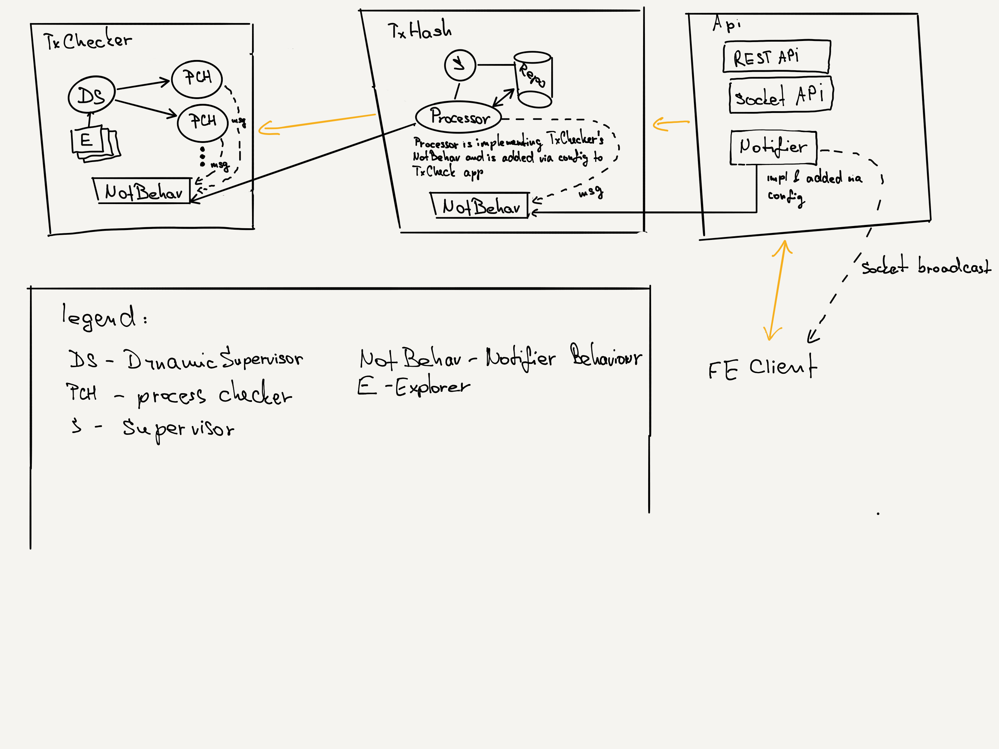

# TxHash Bundle
Containing 2 projects:
- `txhash-fe` is really simple FE written in React & Redux.
- `txhash` elixir umbrella project.

## Run everything together via Docker
- execute: `sh run_bundle.sh`
- in browser open: http://localhost:3000/

This will run docker containers in detach mode (in the background). If you will want to stop them please use
`docker ps` to list your running containers and then kill them by `docker kill ${container_id_from_list}`.

## TxHash FE
Is written in really simple way. No more level state hierarchy, no composing of reducers, no sagas.


### Run only FE
**INSIDE txhash-fe FOLOW**

#### Via docker
- `docker-compose up`

#### Via yarn
- `yarn install`
- `yarn start`


## TxHash.Umbrella

This project is composed by 3 applications. Via REST API or socket communication you can put transaction
hash with specific chain (support ethereum only now) and app will run process for checking
transaction if was confirmed by required number of blocks. If you would use socket communication you
will get back message how checking was ending as checking process could take while until transaction
get required number of confirmations.

### Run umbrella related stuff (eg. run only API server or tests)
**INSIDE txhash (TXHASH UMBRELLA APP) FOLOW**
#### Via docker
Make sure you have properly installed docker: https://docs.docker.com/install/

- run tests: `docker-compose -f docker-compose.yml -f docker-compose-test.yml run umbrella`
- run api server: `docker-compose up` and then visit eg.: http://localhost:4000/api/transactions

#### Via elixir
Please make sure you have ran `mix deps.get` from ubrella app root. This is important. Also make sure
you have correctly set config envs (mainly db settings.) in tx_hash & api projects. You can also
run only PostgresSQL server in docker by `docker-compose up postgres`.

Then also run `mix do deps.get, ecto.setup` in both these projects **tx_hash** & **api** as first.

Or you can run `sh ./scripts/docker_test_script.sh` for run tests and `sh ./scripts/docker_server_script.sh` for run server.

### Application descriptions
#### TxChecker
This application is responsible for checking transactions and confirming them.

Is Composed by DynamicSupervisor which is receiving request for checking transaction
and specific chain. DynamicSupervisor also checking if some process is already checking given transaction,
if not starting new process for checking transaction for specific chain.

You can specify by config different explorer for each chain. Explorer has **interface/behavior** which comunicate with real chain API (eg. ethereumscan).

Application is defining **interface/behaviour** for notifier. From another app you can set by config the notifier
and receive notifications about transaction checking result (eg. sending it to TxHash app).

##### Some config details
- `max_workers` for DynamicSupervisor.
- `max_hits` is number of tries checking transaction. If transaction is not confirmed and `max_hits`
is reached the process is terminated and transaction marked with error max hits reached.
- `chain(eth)_period` time period for transaction checking in specific chain (eg. `eth_period`) as each chain can
have different avg. of block maining and this avg. time can be changed in future.

You can run some sample example by this command in application folder: `iex -S mix run script_test.exs`


#### TxHash
This application is core application which is contains persistent layer and has `tx_checker` application as dependency.
Receiving required transaction, save them into DB and executing TxChecker confirmation process.

Application is implementing TxChecker's **notifier** behaviour and binding it into TxChecker. By this behaviour
the app is receiving back messages about confirmation results and saving this results into given transactions to DB.

This application is also defining **interface/behaviour** for **notifier**. From another app you can set by config the notifier
and receive notifications about transaction checking result (eg. sending it to web app Api). With this application you
can build some REST API or CLI layer.

You can run some sample example by this command in application folder: `mix ecto.reset & iex -S mix run script_test.exs`

#### Api
This application is web communication layer for FE. Implementig REST API and Socket commucation.

Also implementing TxHash's notifier behaviour and binding it into TxHash app for letting client know
about confirmation results via socket channel.


### To Discuss
- DynamicSupervisor has limit for workers now. Can be this limit easily exceed in production? If yes maybe Producer Consumer pipe
would be better solution (eg. via GenStage)
- not sure about how I handled umbrella apps at all. Each app is using own independent config file and not root `txhash/config/..`(from umbrella root).
I was struggling with this default approach as another applications were overwriting configs of different apps.
When I was testing eg. **notifier** in `tx_hash` app, the config of `tx_checker` were overwriting me the notifier config to **mock**.
Not sure if this approach is not over-engineered at all.
- sometimes some tests in tx_hash are randomly failing. Don't know if it is not some side-effect what I am not handling correctly.

### Design Picture
Here I have tried to explain how design is working



### API REST examples
```json
http://localhost:4000/api
Content-Type: application/json; charset=utf-8

## Create transaction for check
POST /transactions
{
  "transaction": {
    "hash": "aaaa",
    "chain": "ethereum"
  }
}

# Invalid chain
http://localhost:4000/api
Content-Type: application/json; charset=utf-8

POST /transactions
{
  "transaction": {
    "hash": "aaaa",
    "chain": "bitcoin"
  }
}

# Detail of transaction
http://localhost:4000/api
Content-Type: application/json; charset=utf-8

GET /transactions/1
```
